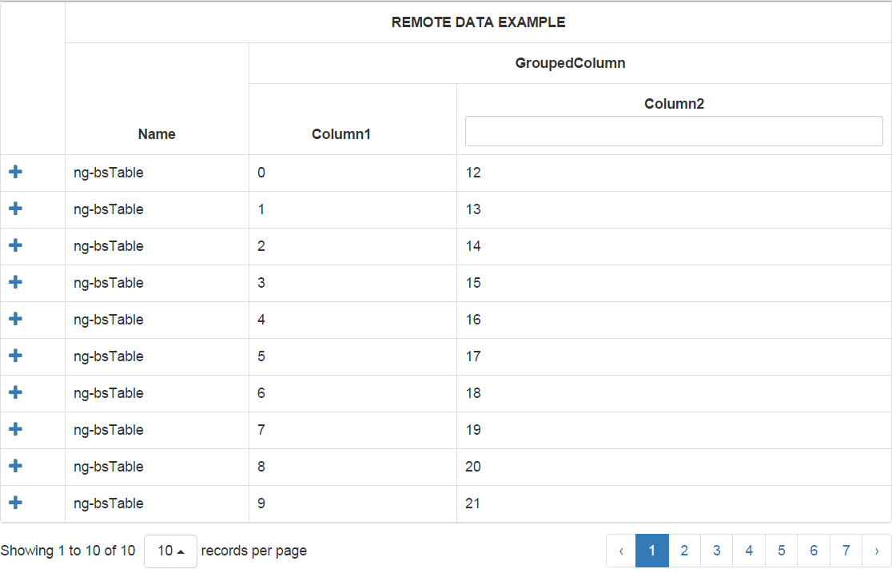

## A Bootstrap Style table for angular2 support sort/paging/edit/grouping Coumn/expandRows
</img>
### How to run demo ?

###  step 1) switch to demo folder and run node app.js

###  step 2) type localhost:8188

## How to implement in project

### step 1) Make sure you have implement the depended libray
    <pre><code>
    <link rel="stylesheet" type="text/css" href="/jslib/bootstrap/css/bootstrap.min.css">
    <link rel="stylesheet" type="text/css" href="/jslib/bootstrap-table/bootstrap-table.min.css">
    <link rel="stylesheet" type="text/css" href="/jslib/bootstrap-editable.css">
    
    
    
    </pre></code>

### step 2) add the component into your angular2 component
 <pre><code>
import { Component,View, Directive} from "angular2/core";
import {ng_bstable} from "./ng-bstable.ts";
@Component({
        selector: "app"
    }
)
@View({
    directives: [ng_bstable],
    template:`
        <ng_bstable [option]="bsOption" [data]="data"></ng_bstable>
    `
})
export class app {
    constructor() {
        this.data = Array.from(new Array(100),(x,i)=>i).map(
          item=>({
              "namex": "ng-bsTable",
              "column1": item,
              "column2": item + 12
          })
        );

        /*
            Or you can use
            this.data = {url:'/remoteUrl',method:'get'};
        */
        this.bsOption = {
            columns:[
                [{
                    "field": "namex",
                    "title": "Name",
                    "colspan": 1,
                    "rowspan": 2
                }, {
                    "title": "GroupedColumn",
                    "colspan": 2,
                    "rowspan": 1
                }],
                [{
                    "field": "column1",
                    "title": "Column1",
                    "colspan": 1,
                    "rowspan": 1,
                    sortable:true
                }, {
                    "field": "column2",
                    "title": "Column2",
                    "colspan": 1,
                    "rowspan": 1,
                    filterable:true
                }]
            ],
            onExpandRow:function(ngEl,_loader,rdata){
                _loader.loadNextToLocation((<Type>ng_bstable),ngEl).then(function(cmp){
                    cmp.instance.option = {
                        columns:[
                            {"field":"name",title:"name"},
                            {"field":"name2",title:"name2"}
                        ]
                    }
                    cmp.instance.data = [{"name":"A","name2":"B"},{"name":"A","name2":"B"}]
                }.bind(this));
            },
            onCollapseRow:function(){
                console.log('collapsed');
            },
            detailView:true,
            pagination:true,
            pageSize:20
        }
    }
}
</code></pre>

### step 3) run the bstable
